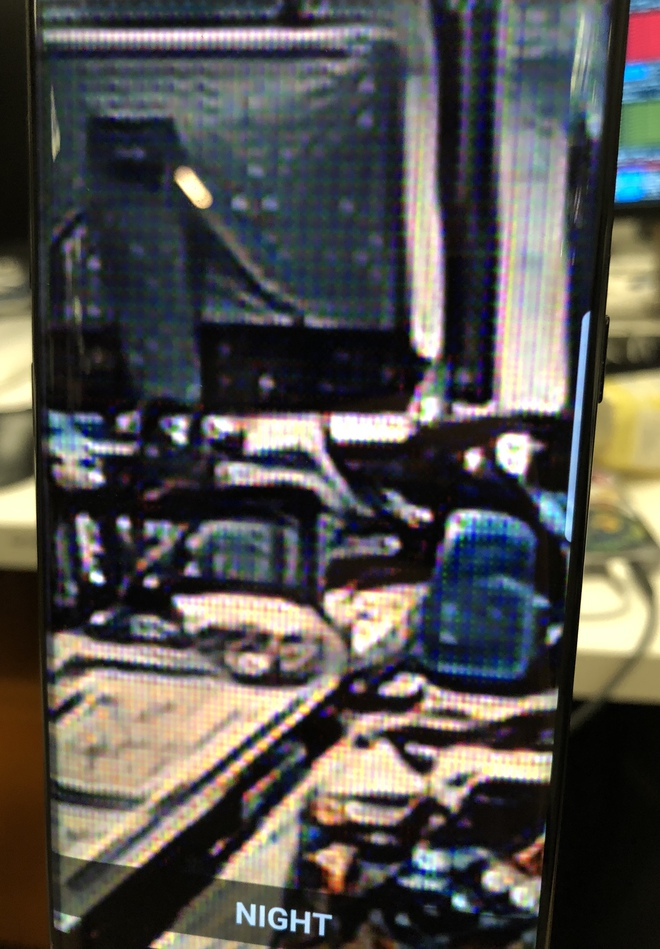

## AICamera-Style-Transfer

  
    
  Neural style transfer on your Android phone.

[AICamera](https://github.com/bwasti/AICamera) is an Android application showcasing implementations of [Caffe2](https://github.com/caffe2/caffe2)
models for mobile. This particular fork implements [Neural Style Transfer](https://arxiv.org/abs/1508.06576), a
unique way of applying artistic styles to photos using deep neural networks.

## Requirements

The app depends mainly on the [Caffe2](https://github.com/caffe2/caffe2) library
to run the models, and
[libyuv](https://chromium.googlesource.com/libyuv/libyuv/) which is used for
image processing. All dependencies are contained in this repository, so no
further setup is required.

If you do want to build the dependencies yourself (for example to pull in more
recent versions of one of the libraries), here are a few steps:

1. For Caffe2, clone the main repository and execute the `build_android.sh`
script found in the `scripts/` folder. This will produce artifacts like
`libcaffe2.a` under the `build_android` folder. Copy these under `app/src/main/jniLibs/armeabi-v7a`.
2. For `libyuv`, follow the steps
[here](https://chromium.googlesource.com/libyuv/libyuv/+/master/docs/getting_started.md).
If the build fails on macOS, consider building on Linux inside a
[Docker](https://github.com/thyrlian/AndroidSDK) container.

All of these steps assume you have a proper Android SDK and NDK environment in place.

## Building

Building the app is as easy as downloading [Android Studio](https://developer.android.com/studio/index.html) and pressing the green button.
